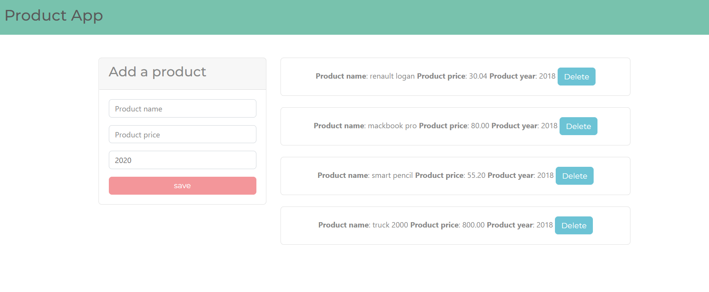

# Learning Object Oriented Programming

*This web page is about adding products to your cart, being aware of how much you have added, have a list of how expensive they are and it's release date *
************************************
This excercise is focused to learn object oriented methods, practicing classes and how JavaScript works behind the scenes.

